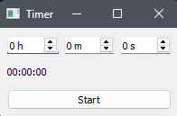

# Python-timer
Countdown timer built with PyQt5 using MVVM architecture and Qt signals/slots

## What it does
A fully functional countdown timer with hours, minutes, 
and seconds input. Supports start, pause, resume, and stop 
functionality with accurate time tracking.

## How to run
1. Install PyQt5: pip install PyQt5
2. Run: python timer.py

## Built with
- Python
- PyQt5 for the GUI
- MVVM architecture (Model, ViewModel, View)
- Qt signals and slots for reactive UI updates
- State machine for timer states

## What I learned
- MVVM design pattern in a GUI application
- PyQt5 signals and slots architecture
- State management with Python Enums
- Accurate timing using time.monotonic()
